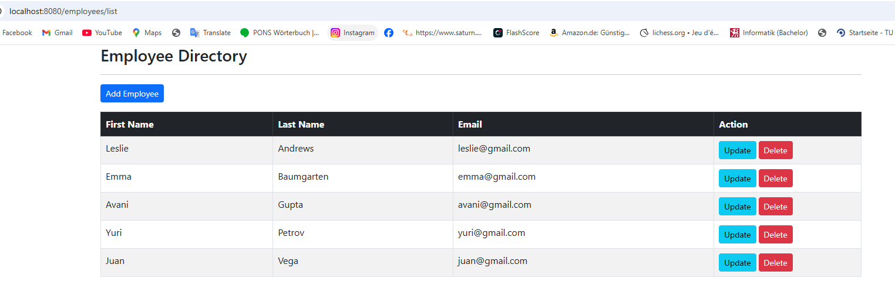

## Project 2 Description

This is a simple Spring Boot project that uses Spring MVC and Thymeleaf performing CRUD operations on a MySQL database with Spring Data JPA.

## Used Technologies
- Maven
- Spring MVC
- Thymeleaf
- Bootstrap CSS
- Spring Data JPA
- CRUD
- MySQL
- Swagger